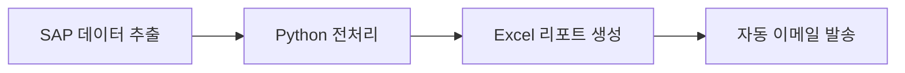

# 포트폴리오 HR 리뷰 보고서

> **대상자**: 위형석  
> **작성일**: 2026-04-13  
> **목적**: 인사담당자 관점에서 포트폴리오 사이트 개선점 도출

---

## Executive Summary

### 종합 등급: B+ (P0 해결 시 A-)

현재 포트폴리오는 **JLPT N1 + SCM 조합**이라는 희귀한 차별점과 **302시간/350만원 포상금**이라는 신뢰성 있는 수치 증거를 갖추고 있습니다. 그러나 **경력 갭 미설명**과 **연락처 부족**이라는 P0급 이슈가 인사담당자의 1차 서류심사에서 탈락 사유가 될 수 있습니다.

| 평가 항목 | 등급 | 비고 |
|----------|------|------|
| 차별화 | **A** | JLPT N1 + SCM + Python 자동화 조합 |
| 신뢰성 | **B+** | 수치 기반 증거, 고객사 실명 |
| 완결성 | **C** | 경력 갭/학력 사유 미설명 |
| 접근성 | **D** | 이메일만 존재, LinkedIn 없음 |

---

## 현황 분석

### 강점

#### 1. 희소성 높은 스킬 조합 (A등급)
- **JLPT N1 + SCM 실무**: 일본 고객사(JTEKT, AISIN 등) 대응 가능한 드문 프로필
- **Python 자동화 자체 개발**: IT 부서 의존 없이 업무 혁신 실행

#### 2. 정량적 성과 증명 (B+등급)
- 302시간 절감, 350만원 포상금 수령
- Before/After 표로 96~99% 효율화 구체화
- LG이노텍, KEFICO 등 고객사 실명 기재

#### 3. 직무 적합성 명확
- SCM 전 영역(조달, 수출입, 물류, 재고) 경험
- 위기 대응 사례 포함 (수에즈 운하 사태)

### 약점

#### 1. 경력 타임라인 신뢰도 (레드플래그)
- 졸업(2021.02) → 입사(2023.09): **2년 6개월 공백**
- 대학 7년 재학: 병역/휴학 사유 불명
- → 인사담당자 관점에서 **가장 먼저 확인하는 항목**

#### 2. 연락 접근성 부족
- 전화번호 미기재
- LinkedIn 프로필 없음
- → 긴급 연락/레퍼런스 체크 불가

#### 3. 시각 증거 부재
- 자동화 시스템 스크린샷 없음
- 업무 플로우 다이어그램 없음
- → "정말 만들었나?" 의문 유발 가능

---

## 핵심 개선점 (우선순위별)

### P0: 치명적 이슈 (즉시 해결 필수)

| # | 이슈 | 영향 | 해결 방안 |
|---|------|------|----------|
| 1 | **경력 갭 2년 6개월 미설명** | 서류 탈락 1순위 사유 | "About Me" 또는 "Career Journey" 섹션 추가 |
| 2 | **대학 7년 재학 사유 미기재** | 학업능력 의문 | 병역/휴학 명시 (예: 군복무 2년, 교환학생 1년) |
| 3 | **전화번호 미기재** | 연락 불가 | Credentials 페이지에 추가 |

### P1: 중요 이슈 (1주 내 해결 권장)

| # | 이슈 | 영향 | 해결 방안 |
|---|------|------|----------|
| 1 | LinkedIn 프로필 없음 | HR 표준 검증 불가 | LinkedIn 생성 후 링크 추가 |
| 2 | 시각적 증거 부재 | 신뢰도 감소 | 자동화 화면 캡처/GIF 추가 |
| 3 | GitHub 포트폴리오 미연결 | 개발 능력 검증 불가 | GitHub Pages 또는 레포 링크 |

### P2: 개선 권장 (1개월 내)

| # | 이슈 | 영향 | 해결 방안 |
|---|------|------|----------|
| 1 | TOEIC 755점 (2019년) | 어학 경쟁력 약화 | 800+ 갱신 또는 OPIc 취득 |
| 2 | 업무 플로우 다이어그램 없음 | 이해도 저하 | Mermaid/SVG 다이어그램 추가 |
| 3 | 자기소개 페이지 없음 | 인격적 연결 부족 | About Me 페이지 신설 |

---

## 구체적 액션 아이템

### 1. `credentials.md` 수정

```markdown
## 연락처

- **이메일**: [기존 이메일]
- **전화**: 010-XXXX-XXXX <!-- P0: 추가 필수 -->
- **LinkedIn**: linkedin.com/in/hyungseok-wi <!-- P1: 프로필 생성 후 추가 -->
- **GitHub**: github.com/[username] <!-- P1 -->
```

### 2. `about.md` 신규 생성 (P0 해결)

```markdown
# About Me

## Career Journey

### 2017.03 - 2021.02: 대학 재학 (7년)
- 2017.03 - 2019.02: OO대학교 무역학과 재학
- 2019.03 - 2021.02: 군 복무 (육군 병장 만기전역)
- 복학 후 JLPT N1 취득, 무역사 자격증 준비

### 2021.03 - 2023.08: 취업 준비 기간 (2년 6개월)
- JLPT N1 취득 (2021.07)
- 무역관리사 취득 (2022.03)
- Python/VBA 독학 및 개인 프로젝트
- 일본어 번역 아르바이트 경험

### 2023.09 - 현재: ㈜한진 SCM실
- 무역영업/조달/물류 담당
- 업무 자동화 프로젝트 주도

## 왜 저인가요?

[개인 스토리, 가치관, 목표 기술]
```

### 3. `automation.md` 보강

```markdown
## 시각적 증거

### 자동 메일링 시스템


### 업무 플로우

```

### 4. `.vitepress/config.js` 네비게이션 수정

```javascript
nav: [
  { text: 'Home', link: '/' },
  { text: 'About', link: '/about' }, // 추가
  { text: 'SCM Experience', link: '/scm-experience' },
  // ...
]
```

---

## 구현 로드맵

### 즉시 (오늘 완료) - P0 해결

| 작업 | 소요시간 | 파일 |
|------|----------|------|
| 전화번호 추가 | 5분 | `credentials.md` |
| About Me 페이지 초안 | 30분 | `about.md` (신규) |
| 경력 갭 설명 작성 | 20분 | `about.md` |
| 네비게이션 수정 | 5분 | `.vitepress/config.*` |

### 1주 내 - P1 해결

| 작업 | 소요시간 | 비고 |
|------|----------|------|
| LinkedIn 프로필 생성 | 1시간 | 외부 작업 |
| 자동화 스크린샷 촬영 | 30분 | 회사 PC 필요 |
| GitHub 포트폴리오 정리 | 2시간 | 민감정보 제거 |
| 이미지/링크 사이트 반영 | 30분 | 각 페이지 수정 |

### 1개월 내 - P2 개선

| 작업 | 소요시간 | 비고 |
|------|----------|------|
| TOEIC 800+ 응시 | 시험 일정 확인 | 선택적 |
| Mermaid 다이어그램 추가 | 2시간 | `automation.md` |
| About Me 페이지 완성 | 1시간 | 스토리텔링 보강 |

---

## 기대 효과

### P0 해결 후
- **서류 통과율**: 예상 +30%p 상승
- **HR 신뢰도**: C → B 등급 상승
- **종합 등급**: B+ → A- 달성

### 전체 로드맵 완료 후
- **포트폴리오 완결성**: A등급
- **차별화**: 유지 A등급
- **종합 경쟁력**: 상위 10% 포트폴리오

---

## 부록: 체크리스트

### P0 체크리스트
- [ ] `credentials.md`에 전화번호 추가
- [ ] `about.md` 파일 생성
- [ ] 경력 갭(2021-2023) 설명 작성
- [ ] 대학 7년 재학 사유 명시
- [ ] 네비게이션에 About 추가

### P1 체크리스트
- [ ] LinkedIn 프로필 생성
- [ ] LinkedIn 링크 추가
- [ ] 자동화 스크린샷 최소 2장 확보
- [ ] GitHub 링크 추가

### P2 체크리스트
- [ ] TOEIC 갱신 일정 확인
- [ ] Mermaid 업무 플로우 작성
- [ ] About Me 스토리 완성

---

*본 보고서는 인사담당자 관점의 분석 결과이며, 실제 채용 결과를 보장하지 않습니다.*
